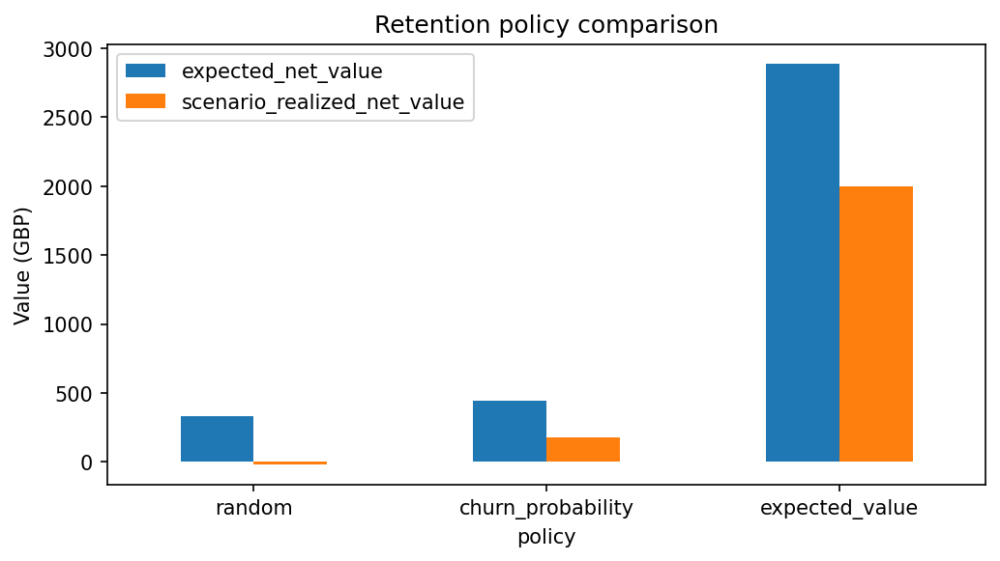
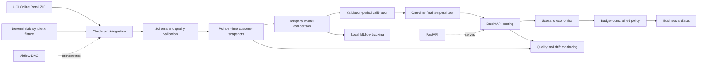
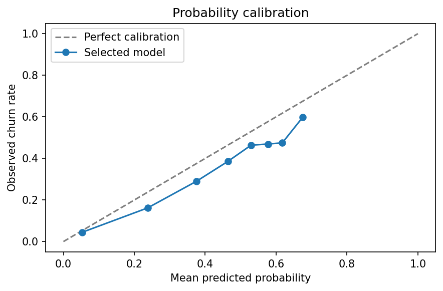
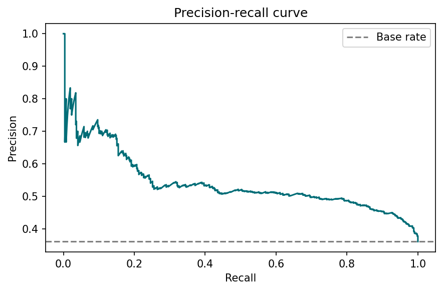
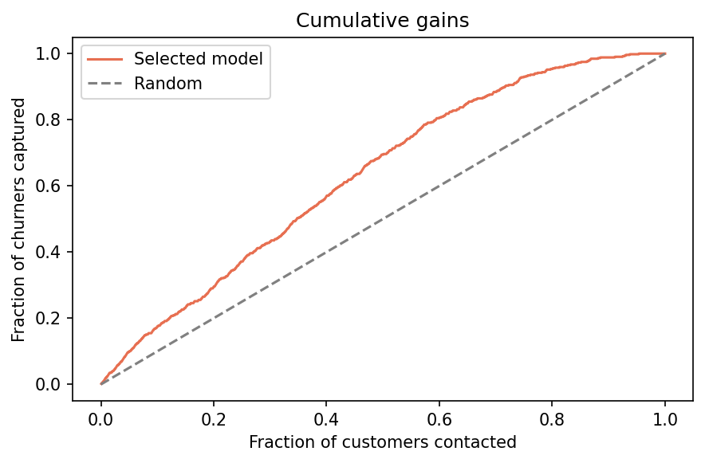
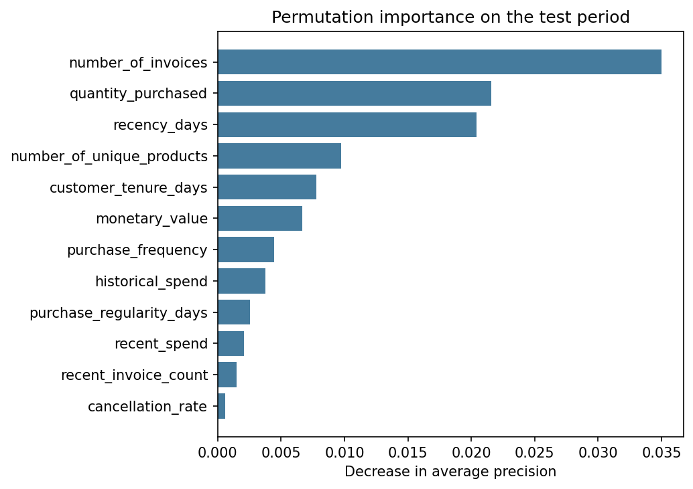
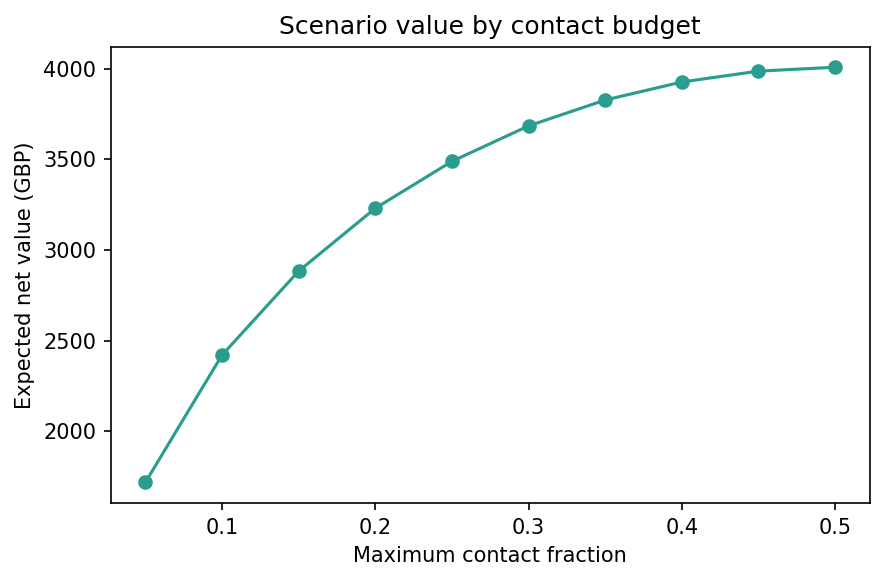

# Customer Churn Decisioning Platform

*Production-oriented machine learning system for identifying at-risk customers, prioritizing retention actions and estimating expected business value.*

[](https://github.com/sgevatschnaider/customer-churn-decisioning-platform/actions/workflows/ci.yml)
[](https://www.python.org/)
[](https://docs.astral.sh/ruff/)
[](LICENSE)

## Executive summary

This repository turns raw retail transactions into leakage-safe customer snapshots, calibrated churn probabilities, and budget-constrained retention decisions. It connects reproducible data ingestion, temporal modeling, scenario economics, MLflow, Airflow, FastAPI, drift monitoring, automated testing, and containerized local services.

The published run uses the official **UCI Online Retail** dataset: 541,909 source rows from
2010-12-01 through 2011-12-09. Rows without a usable customer identifier are excluded from
customer-level modeling. The corrected release restricts every model and campaign cohort to active
repeat buyers using a threshold derived exclusively from training-period purchase cadence.

The corrected UCI metrics are generated only after the complete executable source is published and
are committed separately with the exact source SHA, execution timestamp, configuration hashes,
dataset checksum, Python version, and dependency-lock identifier. Expected value is scenario
analysis—not causal incremental profit—because the dataset contains no retention treatments or
campaign outcomes.

## Actual results

The release results table is populated by the full UCI results commit, never by the synthetic CI
fixture. `artifacts/pipeline_summary.json`, `reports/model_card.md`, and
`reports/business_results.md` carry the machine-readable and narrative evidence.

### Key business recommendation

Use the **value-aware policy** when the stated objective is maximizing scenario value under the
configured margin, campaign-effect, offer-acceptance, and cost assumptions. Use the
**churn-probability policy** when operational success is defined as finding the largest number of
churners. A lower churn lift can coexist with greater scenario value when selected customers carry
larger margin at risk; the generated decomposition table and chart expose that tradeoff rather than
hiding it. Before spending real campaign budget, run a randomized retention experiment and replace
the assumed incremental effect with an identified treatment effect.



## Business problem

The platform answers six operational questions:

1. Which customers are most likely to stop purchasing?
2. Where is the greatest economic value at risk?
3. Who should be contacted under a limited budget?
4. What scenario value could the proposed policy produce?
5. How does it compare with random selection and churn-only ranking?
6. How should schema quality, feature drift, prediction drift, and mature-label performance be monitored?

The output is a decision queue in [`artifacts/retention_targets.csv`](artifacts/retention_targets.csv), with hashed customer IDs, risk, value, action, rank, and selection reason.

## Operational customer eligibility

Every observation must have a complete 180-day feature window, a complete 45-day label window, at
least two positive-purchase invoices, and recency no greater than 81 days. The 81-day ceiling is the
rounded-up 90th percentile (80.091 days) across 6,384 repeat-purchase intervals observed no later
than the final training cutoff. Validation and test outcomes were not used. See
[`docs/customer-eligibility.md`](docs/customer-eligibility.md) and
`artifacts/eligibility_report.json` for method, exclusions, and eligible-population prevalence.

## Architecture



See [`docs/architecture.md`](docs/architecture.md) for component boundaries and operating modes.

## Data source and provenance

The source is [UCI Machine Learning Repository: Online Retail](https://archive.ics.uci.edu/dataset/352/online+retail), donated by Daqing Chen and cited as:

> Chen, D. (2015). *Online Retail* [Dataset]. UCI Machine Learning Repository. DOI: [10.24432/C5BW33](https://doi.org/10.24432/C5BW33).

UCI publishes the dataset under [CC BY 4.0](https://creativecommons.org/licenses/by/4.0/). The repository does not redistribute the workbook. `make data` downloads the official ZIP, verifies archive integrity, checks SHA-256 `f5385cbb54bbebf7196389109c6b0621faab0c304e3702548165e71c84aede8b`, and records a local manifest. The workbook SHA-256 observed in the published run is `43465a06f2ccf7c8b5bd2892bc7defb52f97487934fe93b16ae4c3936424676d`.

The committed fixture is deterministic, synthetic, and used only for tests and CI. It must not be interpreted as UCI or as professional model evidence. Full provenance and quality decisions are in [`docs/data-provenance.md`](docs/data-provenance.md).

## Point-in-time churn definition

Each row represents one customer at one cutoff date:

- features use events in the 180 days ending at the cutoff, inclusive;
- churn equals 1 when no positive purchase occurs in the 45 days strictly after the cutoff;
- incomplete future horizons are rejected;
- source duplicates are reported and deduplicated by stable event ID before aggregation;
- training cutoffs are 2011-06-01 and 2011-07-17;
- validation cutoff is 2011-09-01;
- final test cutoff is 2011-10-17.

Training label windows end before validation; the validation label window ends before test. See [`docs/leakage-prevention.md`](docs/leakage-prevention.md).

## Leakage prevention

Automated assertions verify that feature events do not exceed the cutoff, label events occur only after it, feature/label event sets are disjoint for every snapshot, horizons are fully observable, and temporal partitions do not overlap. Model selection uses training and validation only; the final test is evaluated once inside the training run.

## Modeling strategy

The pipeline compares:

- a recency/trend heuristic;
- class-weighted logistic regression at three regularization strengths;
- HistGradientBoosting with controlled seed and externally configured hyperparameters.

All statistical models use scikit-learn pipelines with median imputation, categorical imputation, one-hot encoding, and model-specific scaling. HistGradientBoosting won on validation PR-AUC and was sigmoid-calibrated on the later validation cohort. Selection is not based on ROC-AUC alone: PR-AUC, Brier score, calibration, budget metrics, lift, and scenario value are all reported.









## Economic decisioning framework

Economic logic is isolated under `src/churn_platform/decisioning/`. The base formula is:

```text
expected_net_value =
    churn_probability × incremental_retention_effect × estimated_margin_at_risk
    − contact_cost
    − offer_acceptance_probability × offer_cost_if_accepted
```

Budget, contact and offer costs, campaign effect, offer acceptance, contact fraction, margin rate,
and the aligned 45-day horizon are externalized in
[`configs/decisioning.yaml`](configs/decisioning.yaml). Only positive-value customers are eligible
for value-aware contact. Reports distinguish financial capacity, operational capacity, positive-value
eligibility, actual selected customers, the binding constraint, expected campaign cost, remaining
budget, utilization, and expected value per contact.



Sensitivity spans incremental retention effect, offer acceptance, and margin assumptions. Its
generated range is evidence that economics—not only model discrimination—drives the decision.

## Project structure

```text
configs/                 Data, model, and economic assumptions
data/fixtures/           Deterministic synthetic CI transactions
src/churn_platform/      Reusable data, features, models, policy, monitoring, API
dags/churn_pipeline.py   Eleven-stage Airflow DAG
tests/                   Unit and integration tests
reports/                 Generated model card, business, monitoring, and figures
docs/                    Architecture, provenance, leakage controls, API, ADRs
artifacts/                Hashed decision queue and compact run summaries
.github/workflows/       Credential-free fixture CI
```

Generated raw data, models, Parquet tables, local MLflow stores, and secrets are ignored.

## Quick start

Python 3.11 or 3.12 is required.

```bash
python -m venv .venv
source .venv/bin/activate          # Windows PowerShell: .venv\Scripts\Activate.ps1
python -m pip install --upgrade pip
python -m pip install -r requirements.lock
python -m pip install --no-deps -e .

# Fast, credential-free end-to-end verification
python -m churn_platform.cli pipeline --source fixture

# Official UCI run
python -m churn_platform.cli pipeline --source uci
```

GNU Make wrappers include `install`, `data`, `validate`, `features`, `train`, `evaluate`, `decision`, `report`, `pipeline`, `api`, `test`, `lint`, `format`, `monitoring`, `docker-up`, `docker-down`, and `ci`. Set `SOURCE=uci` for full-data stage commands; the safe default is `fixture`.

## API

Start the service after a pipeline run:

```bash
make api
curl http://localhost:8000/health/live
curl http://localhost:8000/health/ready
curl http://localhost:8000/model-info
```

Prediction example:

```bash
curl -X POST http://localhost:8000/predict \
  -H "Content-Type: application/json" \
  -d '{
    "customer_id":"EXAMPLE-001","recency_days":45,"purchase_frequency":1.2,
    "monetary_value":1200,"average_order_value":100,"customer_tenure_days":180,
    "number_of_invoices":12,"number_of_unique_products":20,
    "purchase_regularity_days":8,"recent_purchasing_trend":-0.2,
    "cancellation_rate":0.05,"quantity_purchased":60,
    "geographic_segment":"Europe","recent_spend":200,"historical_spend":400,
    "spend_change_ratio":0.5,"recent_invoice_count":2,
    "historical_invoice_count":4,"frequency_change_ratio":0.6
  }'
```

Replace `/predict` with `/decision` to receive margin at risk, expected net value, economic
eligibility, an explanation, the complete scenario, and a notice that final selection needs the
portfolio. Use `/batch-decisions` for the actual budget-constrained ranking and final contact action.
Batch requests are capped at 1,000 unique customer records. See [`docs/api.md`](docs/api.md).

## MLflow and Airflow

Training logs parameters, feature names, periods, exact source/data/configuration lineage, tracking
URI, final metrics, plots, economic configuration, signed model input schema, and the calibrated
model. URI precedence is explicit argument, `MLFLOW_TRACKING_URI`, then the local `mlruns` file URI.

```bash
mlflow ui --backend-store-uri ./mlruns --port 5000
```

Open `http://localhost:5000`. The published local run metadata is in `artifacts/mlflow_run.json`; the local MLflow store itself is intentionally ignored.

The Airflow DAG contains eleven explicit stages and calls the same package functions used by the CLI. It defaults to UCI when run in Airflow; set `PIPELINE_SOURCE=fixture` for a smoke run.

```bash
docker compose --profile orchestration run --rm airflow-init
docker compose --profile orchestration up --build -d \
  airflow-webserver airflow-scheduler mlflow
```

Open Airflow at `http://localhost:8080` and MLflow at `http://localhost:5000`. Local credentials come from `.env`; only non-secret examples are versioned.

Docker was unavailable in the release-authoring environment. No container-network smoke test or UI
screenshot is claimed. Exact capture commands and acceptance checks are documented in
[`docs/operational-evidence.md`](docs/operational-evidence.md).

## Docker

Profiles keep the stack modular:

```bash
# API and experiment tracking
docker compose --profile api --profile tracking up --build -d

# Orchestration stack
docker compose --profile orchestration up --build -d

docker compose --profile api --profile tracking --profile orchestration down
```

PostgreSQL backs Airflow metadata in the containerized mode. MLflow uses a separate persistent SQLite backend to avoid migration-table collisions. The CLI remains fully usable without Docker or Airflow.

## Testing and CI

```bash
make lint
python -m ruff format --check .
make test
make ci
```

The suite covers eligibility, leakage, horizon alignment, economic assumptions, every campaign
constraint, MLflow URI precedence, readiness/degraded states, portfolio API behavior, monitoring,
and DAG structure. Coverage must remain at or above 80%. GitHub Actions installs from the lock,
runs lint/format checks, unit and integration tests, the complete fixture pipeline, API import and
behavior, DAG contract, and Docker Compose configuration. It never downloads UCI or requires
credentials.

## Monitoring

The monitoring module checks missing columns, numeric type errors, reference ranges, missingness changes, new categories, PSI, KS, probability drift, and performance after labels mature. The published UCI test batch raised one diagnostic warning: customer-tenure PSI = 0.346. This is expected context for a later temporal cohort and requires investigation; it does not trigger automated retraining.

See [`reports/monitoring_report.md`](reports/monitoring_report.md). Schema/type failures should block scoring. Distribution and performance alerts require human review.

## Limitations

- Churn is inactivity over 45 days, not a customer-declared cancellation.
- Wholesale behavior and seasonality limit generalization beyond this retailer and period.
- Missing CustomerID rows cannot support customer-level snapshots.
- Margin is estimated from historical spend; actual gross margin is unavailable.
- Campaign consent, deliverability, capacity, and fairness outcomes are absent.
- Incremental retention effect and offer acceptance probability are scenario assumptions, not causal estimates.
- A 90-day economic view requires a separately trained 90-day model or survival analysis; the 45-day probability is not extrapolated.
- Monitoring compares temporal cohorts but cannot diagnose every business regime change.

## Responsible use

Use recommendations as a reviewed outreach queue, not an automatic adverse decision. Do not use the model for credit, pricing, eligibility, or differential service. Validate lawful outreach, consent, suppression lists, geographic fairness, customer burden, and experiment design. Stop scoring on blocking schema errors and investigate material drift before acting.

## Roadmap

- estimate treatment effects from randomized retention campaigns;
- add uplift/Qini evaluation and policy learning;
- introduce a feature store or warehouse adapter with point-in-time joins;
- add managed model registry and deployment promotion gates;
- implement segment-level calibration and fairness monitoring;
- capture realized campaign cost, response, and incremental margin.

## Author

**Sergio Gevatschnaider — Data Scientist | Economist | PhD in Economic Sciences**

[sgdataconsulting.com](https://sgdataconsulting.com/)
