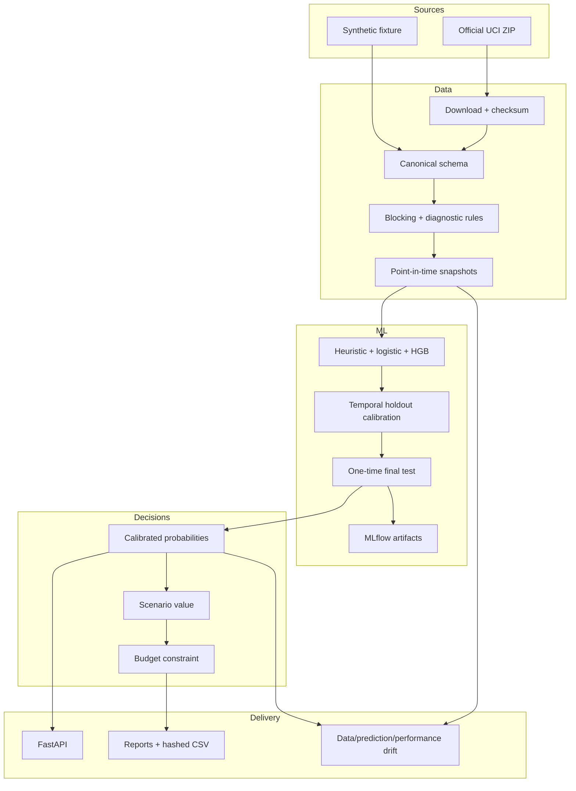

# Architecture

## Design goals

The platform separates data lineage, predictive modeling, economic assumptions, and delivery interfaces so that each layer can be tested and changed independently. The local implementation is deliberately production-oriented: it has repeatable boundaries and operational contracts without claiming enterprise deployment.

## Component boundaries

- `data`: official acquisition, canonical ingestion, deterministic fixture generation, and blocking validation.
- `features`: all point-in-time aggregation and temporal lineage assertions.
- `models`: candidate pipelines, temporal selection, probability calibration, test evaluation, plots, serialization, and MLflow.
- `decisioning`: economic assumptions and three independently testable policies.
- `monitoring`: reference baseline, batch drift, mature-label performance, and human-readable alerts.
- `api`: strict request/response contracts and lazy artifact loading.
- `pipeline`: idempotent file-backed stages shared by CLI and Airflow.

## Operating modes

1. The CLI is the primary recovery and local reproducibility path. It requires no scheduler.
2. Airflow calls the same stage functions and keeps large frames out of XCom.
3. FastAPI serves an already-validated artifact and never trains a model.
4. Docker Compose provides API, MLflow/PostgreSQL, and Airflow profiles.

## Data contracts

Raw UCI names are normalized once. Models receive only the feature list declared in `build_features.py`. A serialized `ModelBundle` carries feature names, model version, training periods, validation comparison, and final metrics. Public decision artifacts hash source customer identifiers and never publish the raw workbook.

## Failure behavior

Missing columns, unparseable dates, excessive negative prices, excessive duplicates, incomplete label horizons, temporal overlap, missing model artifacts, and invalid API ranges fail explicitly. Drift warnings do not retrain or change a campaign automatically.

