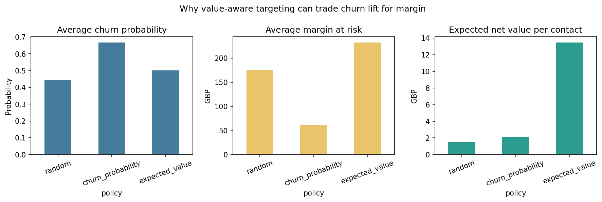

# Business Results

## Executive summary

This report is generated from an actual **UCI Online Retail** pipeline run. Under a 15% contact limit, the value-aware policy selected 214 customers, captured 17.4% of observed churners, and produced scenario expected net value of GBP 2,884.17.

## Operationally eligible population

- Customer observations before eligibility: 11,213
- Eligible active-repeat observations: 5,154
- Excluded observations: 6,059
- Final test customers before eligibility: 3,025
- Final eligible test customers: 1,433
- Final test exclusions: 1,592
- Eligible-population churn prevalence: 42.8%
- Exclusion criteria failures: `{'incomplete_observation_history': 0, 'incomplete_future_label_horizon': 0, 'recency_above_maximum': 3534, 'insufficient_invoices': 5231}`
- Primary exclusion reasons: `{'insufficient_invoices': 2525, 'recency_above_maximum': 3534}`

## Budget and recommended policy

- Scenario budget: GBP 12,000.00
- Contact cost: GBP 2.00
- Offer cost if accepted: GBP 12.00
- Offer acceptance probability: 35%
- Incremental retention effect: 20%
- Economic and prediction horizon: 45 days
- Maximum contact fraction: 15%
- Budget-based contact capacity: 1,433
- Operations-based contact capacity: 214
- Economically eligible customers: 718
- Actual selected customers: 214
- Binding constraint: `operational_capacity`
- Expected campaign cost: GBP 1,326.80
- Remaining budget: GBP 10,673.20
- Budget utilization: 11.1%
- Expected value per contacted customer: GBP 13.48
- Recommendation: use positive expected net value ranking as a review queue, subject to consent, operational capacity, and an experimental campaign design.

## Policy comparison

| policy            |   customers_contacted |   average_churn_probability |   average_estimated_margin_at_risk |   expected_net_value_per_contact |   observed_churn_rate |   recall_at_budget |   precision_at_budget |   lift_at_budget | expected_net_value   | expected_campaign_cost   | binding_constraint   | scenario_realized_net_value   |
|:------------------|----------------------:|----------------------------:|-----------------------------------:|---------------------------------:|----------------------:|-------------------:|----------------------:|-----------------:|:---------------------|:-------------------------|:---------------------|:------------------------------|
| random            |                   214 |                       0.442 |                             175.09 |                             1.54 |                 0.362 |              0.15  |                 0.362 |            1.005 | 330.36               | 1,326.80                 | operational_capacity | -19.98                        |
| churn_probability |                   214 |                       0.668 |                              61.22 |                             2.09 |                 0.556 |              0.23  |                 0.556 |            1.541 | 447.09               | 1,326.80                 | operational_capacity | 179.32                        |
| expected_value    |                   214 |                       0.501 |                             232.37 |                            13.48 |                 0.421 |              0.174 |                 0.421 |            1.166 | 2,884.17             | 1,326.80                 | operational_capacity | 1,999.35                      |

The random benchmark reports the mean across 200 deterministic seeded policy draws. `scenario_realized_net_value` uses observed churn labels and the configured incremental effect; it is still not causal profit.

## Value-versus-lift decomposition

The value-aware policy deliberately prioritizes margin at risk rather than churn probability alone. Its observed lift is 1.166, above random selection but lower than the churn-probability policy at 1.541. Compare average churn probability, average margin, expected value per contact, observed churn rate, recall, precision, lift, campaign cost, and total expected value. Higher customer margin can outweigh fewer captured churners under the scenario formula.

## Sensitivity

Across 27 unique configurations, expected net value ranged from GBP 258.91 to GBP 8,269.89. The analysis varies incremental effect, offer acceptance, and gross-margin scaling.

## Risks and next steps

The source contains no treatment assignment or campaign response, so retention effect and offer acceptance are configurable scenario inputs rather than causal estimates. A real next step is a randomized controlled retention experiment, followed by uplift modeling and segment-level fairness, consent, deliverability, and capacity checks. A 90-day economic horizon would require a separately trained 90-day model or survival analysis; the 45-day probability is not extrapolated.
